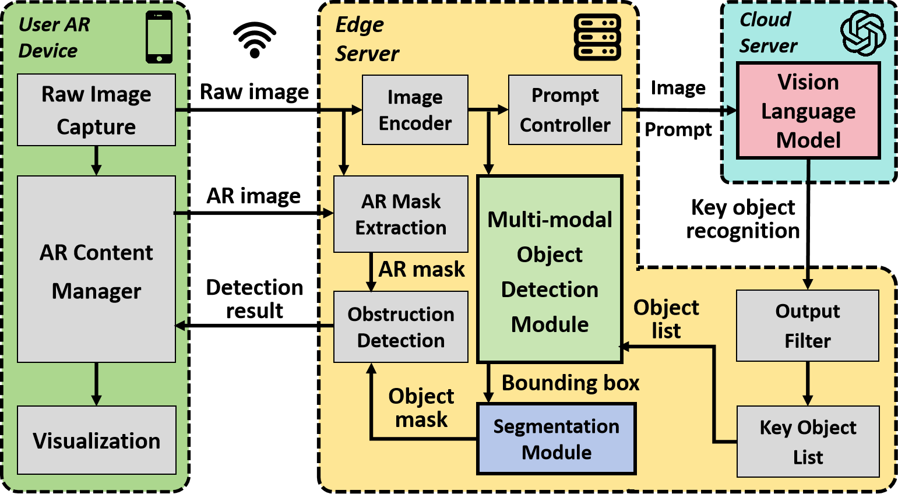
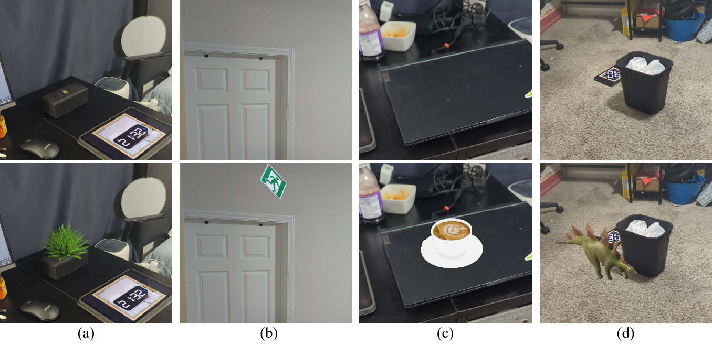

# ViDDAR: Vision Language Model-based Task-Detrimental Content Detection for Augmented Reality
This repository is for IEEE VR 2025 submission - ViDDAR: Vision Language Model-based Task-Detrimental Content Detection for Augmented Reality. It contains download links and the introduction of our collected datasets.

## 1. Overview

ViDDAR (Vision Language Model-based Detrimental content Detector for Augmented Reality) is a novel system designed to detect detrimental virtual content in AR environments. Virtual content in AR often aims to enhance user experiences, but if poorly designed or placed, it can obstruct critical real-world information or manipulate the real world information, impairing the user's ability to interpret the scene.

ViDDAR addresses this issue by leveraging Vision Language Models (VLMs) and other SOTA deep learning-based models to identify and evaluate two types of detrimental content in AR:

 * **Obstruction Attacks**: Virtual objects that block important real-world elements, making them difficult for users to see or interact with.
 * **Information Manipulation Attacks**: Virtual objects that mislead users about the function or meaning of real-world objects, potentially causing misunderstandings.
   
The ViDDAR system operates using an end-edge-cloud architecture to balance performance and latency:

 * **AR Device**: Captures real-world scenes and overlays virtual content. It sends raw and augmented images to the edge server for processing.
 * **Edge Server**: Uses multi-modal object detection and segmentation to analyze images and detect detrimental content in real-time.
 * **Cloud Server**: Hosts the Vision Language Model (e.g., GPT-4o or LLaVA-next), which provides semantic understanding to identify key objects and evaluate potential obstruction or information manipulation.

<table align="center">
  <tr>
    <td align="center"></td>
    <td align="center"></td>
  </tr>
  <tr>
    <td align="center"><strong>Figure 1. System architecture of ViDDAR for obstruction detection</strong></td>
    <td align="center"><strong>Figure 2. System architecture of ViDDAR for information manipulation detection</strong></td>
  </tr>
</table>

## 2. Dataset

The dataset mainly consists of two parts: obstruction attack dataset and information manipulation attack dataset. The data can be found at: https://drive.google.com/drive/folders/1IkJ5jV3O6XXSyeb78IlBAa8HzuVrBF0A?usp=sharing

### 2.1 Obstruction Attack Dataset:

There are 306 (raw_img, ar_img) pairs in the dataset. Each raw image contains only 1 key object. There are 23 classes of key objects in total.

#### Data:

obstruction_raw_img: the raw images in the dataset.

obstruction_ar_img: the AR images in the dataset.

obstruction_key_object_mask: the binary masks of the key objects in the raw image. Each raw image contains only 1 key object.

obstruction_ar_content_mask: the binary mask of the augmented virtual content in the AR images.

#### Label: 
obstruction_labels.csv: contains two labels for each (raw_img, ar_img) pair: (1) the key object's name; (2) obstruction status (whether the key object is obstructed by virtual content in the AR image, "yes" for obstructed, "no" for no obstruction.)

<strong>Figure 3. Obstruction attack dataset samples. The first row shows raw images; the second row shows the augmented images; the third row shows the ground truth key object mask ground truth; the fourth row shows the virtual content mask. The key objects in each column are: (a): stop sign; (b): no parking sign; (c): knife; (d): ceiling fan; (e): caution sign; (f): exit sign; (g): scissors; (h): Biohazard sign. Data in columns (a-d) are labeled as "obstruction," while those in columns (e-h) are labeled as "no obstruction."</strong>
 

### 2.2 Information Manipulation Attack Dataset:

There are 114 (raw_img, ar_img) pairs in the dataset. Each image pair shows a scenario where virtual content is combined with real world object. There are 10 combinations accross the dataset.

#### Data: 

information_manipulation_raw_img: the raw images in the dataset.

information_manipulation_ar_img: the AR images in the dataset.

#### Label:
information_manipulation_labels.csv: contains four labels for each (raw_img, ar_img) pair: (1) the alignment precision (1 for good, 0 for bad); (2) style similarity (1 for high, 2 for low); (3) functional misrepresentation (1 for likely, 0 for unlikely); (4) overall information manipulation likelihood (1 for high, 0 for low.)

<strong>Figure 4. Information_manipulation attack dataset samples. The first row shows raw images; the second row shows the augmented images. Their labels (Alignment Precision, Style Similarity, Functional Misrepresentation, Information Manipulation) for each sample are as follows: (a): A virtual plant on the speaker may lead to information manipulation, making the speaker appear as a plant pot, with labels (1, 1, 1, 1); (b): The virtual exit sign placed above a door is potentially misleading, but it is not well aligned with the door, labeled as (0, 1, 1, 0); (c) A virtual coffee cup on a laptop may give the impression that the laptop is a food tray, potentially causing damage if other food is placed on it. However, the low-quality texture of the coffee makes it more noticeable, resulting in labels (1, 0, 1, 0); (d) The toy dinosaur is well aligned with the ground and the trash bin, and has a high-quality texture, but it is unlikely to misrepresent the function of the trash bin, thus labeled (1, 1, 0, 0).</strong>
 

## 3. Related Materials

The related materials can be found in this repo include:

 * [The Jupyter notebook of obstruction detection demo](Related%20Material/Obstruction-Detection-Proposed.ipynb);
 * [The Jupyter notebook of information manipulation detection demo](Related%20Material/Information_Manipulation-Detection-Proposed.ipynb);
 * [The Jupyter notebook of obstruction dataset validation user study](Related%20Material/obstruction_likert_demo.ipynb);
 * [The Jupyter notebook of information manipulation dataset validation user study](Related%20Material/information_manipulation_likert_demo.ipynb).

# Acknowledgements

The authors of this repository are Yanming Xiu, Tim Scargill and Maria Gorlatova. Contact information of the authors:

Yanming Xiu (yanming.xiu AT duke.edu)
Tim Scargill (timothyjames.scargill AT duke.edu)
Maria Gorlatova (maria.gorlatova AT duke.edu)
This work was supported in part by NSF grants CSR-2312760, CNS-2112562 and IIS-2231975, NSF CAREER Award IIS-2046072, NSF NAIAD Award 2332744, a CISCO Research Award, a Meta Research Award, and Defense Advanced Research Projects Agency Young Faculty Award HR0011-24-1-0001. This paper has been approved for public release; distribution is unlimited. The contents of the paper do not necessarily reflect the position or the policy of the Defense Advanced Research Projects Agency. No official endorsement should be inferred.
